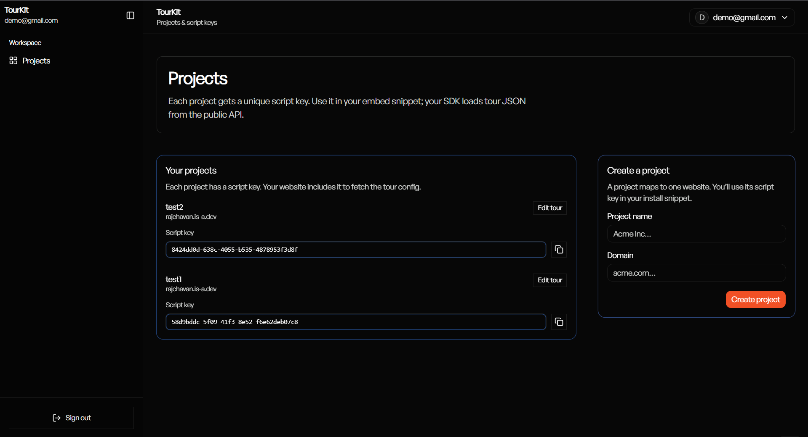
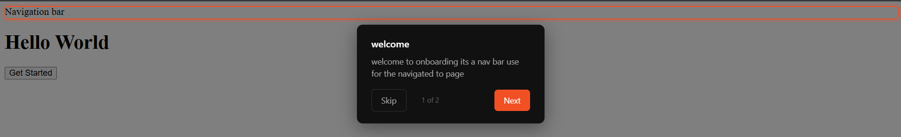
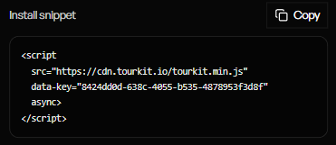
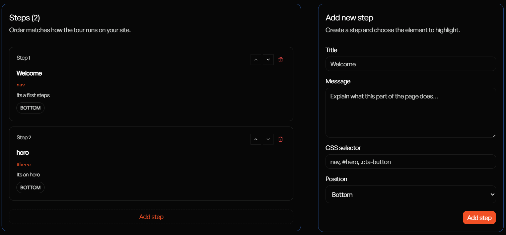

# TourKit

> Product tours for any website.
> One script tag. No npm install. 
> Works on React, Next.js, Vue, 
> WordPress, and plain HTML.





<!-- Badges row -->
[](LICENSE)
[](https://cdn.jsdelivr.gh/webdev-raj/Tourkit@sdk-v14/sdk/dist/tourkit.min.js)
[](https://tourkit-phi.vercel.app/demo)
[](https://tourkit-phi.vercel.app)

---

## ⚡ Quick Start

Paste this before </body> on any website:

```html
<script
  src="https://cdn.jsdelivr.net/gh/webdev-raj/Tourkit@sdk-v14/sdk/dist/tourkit.min.js"
  data-key="YOUR_SCRIPT_KEY"
  data-api="https://tourkit-phi.vercel.app"
  async>
</script>
```



That's it. Go to the dashboard, 
create your tour steps, and they 
appear on your site automatically.
No redeployment needed.

---

## 🆚 Why TourKit

| | TourKit | Intercom | Shepherd.js |
|--|---------|----------|-------------|
| Price | $19/mo | $500+/mo | Free |
| Setup | 1 script tag | Full SDK | npm install |
| Mobile support | ✅ Bottom sheet | ❌ None | ⚠️ Broken |
| Framework lock-in | ❌ None | ✅ Required | ✅ Required |
| Dashboard control | ✅ Yes | ✅ Yes | ❌ No |
| URL-based triggers | ✅ Yes | ✅ Yes | ❌ No |
| Analytics | ✅ Built-in | ✅ Yes | ❌ No |

---

## ✨ Features

**Context-aware tours**
Trigger steps by URL — exact paths, 
dynamic segments (/projects/[id]), 
or wildcards (/dashboard/*).
Right step, right page, automatically.

**Mobile bottom sheet**
The only tour SDK with native mobile support.
Element stays highlighted at top.
Tooltip slides up from bottom.
Feels intentional, not broken.

**One script embed**
Vanilla JS SDK via CDN.
Zero framework lock-in.
Works on React, Next.js, Vue, 
WordPress, and plain HTML.

**Dashboard controlled**
Publish step changes without redeploying.
Your site fetches config dynamically.
Update tours in seconds.



**Step analytics**
Completion rates, drop-off per step,
and session tracking built into 
every project automatically.

**AI tour generator (Pro)**
Describe your product → AI generates
ready-to-use tour steps instantly.

**Agent-ready JSON import (Pro)**
Paste our prompt into Cursor or Claude.
Agent analyzes your codebase, adds 
data-tourkit attributes, generates tour.json.
Drag and drop to import. Done in 2 minutes.

**Prebuilt templates**
One click → your tour matches a 
professional design system instantly.
Obsidian, Chalk, Matrix, Sakura and more.

---

## 🌐 Framework Support

### React / Next.js

Add TourKitProvider for client-side 
navigation support:

```jsx
'use client'
import { useEffect } from 'react'
import { usePathname } from 'next/navigation'

export default function TourKitProvider() {
  const pathname = usePathname()

  useEffect(() => {
    const timer = setTimeout(() => {
      window.TourKit?.startFor(pathname)
    }, 500)
    return () => clearTimeout(timer)
  }, [pathname])

  return null
}

// Add to your root layout:
// <TourKitProvider />
```

### Vue

```js
// In your router
router.afterEach((to) => {
  setTimeout(() => {
    window.TourKit?.startFor(to.path)
  }, 500)
})
```

### Plain HTML

```html
<!-- Just paste before </body> -->
<script
  src="https://cdn.jsdelivr.net/gh/webdev-raj/Tourkit@sdk-v14/sdk/dist/tourkit.min.js"
  data-key="YOUR_SCRIPT_KEY"
  data-api="https://tourkit-phi.vercel.app"
  async>
</script>
```

---

## 🎮 Global API

After the script loads, control tours 
programmatically from anywhere:

```js
// Start tour for specific page
window.TourKit.startFor('/dashboard')

// Start from beginning
window.TourKit.start()

// Destroy active tour
window.TourKit.destroy()

// Reset seen flag for a path
window.TourKit.reset('/dashboard')

// Reset all seen flags
window.TourKit.resetAll()
```

---

## 🤖 AI Agent Integration (Pro)

The fastest way to set up TourKit:

1. Copy the AI prompt from your dashboard
2. Paste into Cursor, Claude Code, 
   or GitHub Copilot
3. Agent analyzes your codebase,
   adds data-tourkit attributes,
   generates tour.json automatically
4. Drag tour.json into TourKit dashboard
5. Tour is live in under 2 minutes

---

## 📊 Analytics

Every project gets built-in analytics:

- Tour start rate
- Completion rate  
- Skip rate
- Step-by-step drop-off
- Session tracking

No extra setup needed.

---

## 💰 Pricing

**Free**
- 1 project
- Basic analytics
- 3 prebuilt templates
- Community support

**Pro — $19/month**
- Unlimited projects
- Full analytics dashboard
- All prebuilt templates
- AI tour generator
- JSON import with agent prompt
- No TourKit branding
- Priority support

---

## 🛠️ Tech Stack

| Layer | Technology |
|-------|-----------|
| Dashboard | Next.js 14 App Router |
| Database & Auth | Supabase |
| Styling | Tailwind CSS + shadcn/ui |
| Client SDK | Vanilla JavaScript |
| SDK Bundler | esbuild |
| Hosting | Vercel |
| CDN | jsDelivr |

---

## 🏗️ Local Development

### 1. Clone the repo

```bash
git clone https://github.com/webdev-raj/Tourkit.git
cd Tourkit
```

### 2. Install dependencies

```bash
npm install
```

### 3. Set up environment variables

```bash
cp .env.local.example .env.local
```

```env
NEXT_PUBLIC_SUPABASE_URL=your_supabase_url
NEXT_PUBLIC_SUPABASE_ANON_KEY=your_anon_key
SUPABASE_SERVICE_ROLE_KEY=your_service_role_key
NEXT_PUBLIC_APP_URL=http://localhost:3000
ANTHROPIC_API_KEY=your_anthropic_key
```

### 4. Run dev server

```bash
npm run dev
```

### 5. Build SDK

```bash
cd sdk
npm install
npm run build
```

### 6. Supabase Database Schema

Run the following schema in the Supabase SQL Editor (or as a migration) to set up the necessary tables, indexes, and Row Level Security (RLS) policies:

```html
// TourKit (Supabase) schema + RLS
// Run in Supabase SQL Editor (or as a migration).

create extension if not exists "pgcrypto";

// Projects table
create table if not exists projects (
  id uuid primary key default gen_random_uuid(),
  user_id uuid references auth.users(id) on delete cascade,
  name text not null,
  domain text not null,
  script_key text unique not null default gen_random_uuid()::text,
  is_active boolean default true,
  created_at timestamptz default now()
);

// Tours table
create table if not exists tours (
  id uuid primary key default gen_random_uuid(),
  project_id uuid references projects(id) on delete cascade,
  name text default 'Default Tour',
  is_active boolean default true,
  created_at timestamptz default now()
);

// Steps table
create table if not exists steps (
  id uuid primary key default gen_random_uuid(),
  tour_id uuid references tours(id) on delete cascade,
  selector text not null,
  title text,
  message text not null,
  position text default 'bottom', -- top | bottom | left | right
  step_order integer not null,
  created_at timestamptz default now()
);

// Analytics events (ingested server-side via service role)
create table if not exists analytics_events (
  id uuid primary key default gen_random_uuid(),
  project_id uuid references projects(id) on delete cascade,
  event_type text not null, -- tour_started | tour_completed | tour_skipped | step_viewed
  step_order integer,
  session_id text,
  created_at timestamptz default now()
);

// Helpful indexes
create index if not exists projects_user_id_idx on projects(user_id);
create index if not exists projects_script_key_idx on projects(script_key);
create index if not exists tours_project_id_idx on tours(project_id);
create index if not exists steps_tour_id_order_idx on steps(tour_id, step_order);
create index if not exists analytics_events_project_id_created_at_idx on analytics_events(project_id, created_at desc);

// Row Level Security
alter table projects enable row level security;
alter table tours enable row level security;
alter table steps enable row level security;
alter table analytics_events enable row level security;

// Projects: owners can do everything
drop policy if exists "Users own their projects" on projects;
create policy "Users own their projects" on projects
  for all
  using (auth.uid() = user_id)
  with check (auth.uid() = user_id);

// Tours: owners via project ownership
drop policy if exists "Users own their tours" on tours;
create policy "Users own their tours" on tours
  for all
  using (
    project_id in (select id from projects where user_id = auth.uid())
  )
  with check (
    project_id in (select id from projects where user_id = auth.uid())
  );

// Steps: owners via project ownership
drop policy if exists "Users own their steps" on steps;
create policy "Users own their steps" on steps
  for all
  using (
    tour_id in (
      select t.id
      from tours t
      join projects p on p.id = t.project_id
      where p.user_id = auth.uid()
    )
  )
  with check (
    tour_id in (
      select t.id
      from tours t
      join projects p on p.id = t.project_id
      where p.user_id = auth.uid()
    )
  );

// Analytics: owners can read their analytics; inserts come from server (service role bypasses RLS)
drop policy if exists "Users can read analytics events" on analytics_events;
create policy "Users can read analytics events" on analytics_events
  for select
  using (
    project_id in (select id from projects where user_id = auth.uid())
  );
```

---

## 🗺️ Roadmap

- [x] One script tag SDK
- [x] Dashboard tour builder
- [x] CSS selector targeting
- [x] Analytics tracking
- [x] URL-based tour triggers
- [x] Mobile bottom sheet tours
- [x] AI tour generator
- [x] JSON drag and drop import
- [x] Prebuilt tooltip templates
- [x] Google OAuth
- [ ] npm package
- [ ] Vue plugin
- [ ] Checklist widget
- [ ] Video tours
- [ ] A/B testing
- [ ] Multi-language support
- [ ] Team collaboration

---

## 📄 License

MIT © Raj Chavan

---

## 🔗 Links

- **Live app:** https://tourkit-phi.vercel.app
- **Docs:** https://tourkit-phi.vercel.app/docs
- **Live demo:** https://tourkit-phi.vercel.app/demo
- **GitHub:** https://github.com/webdev-raj/Tourkit